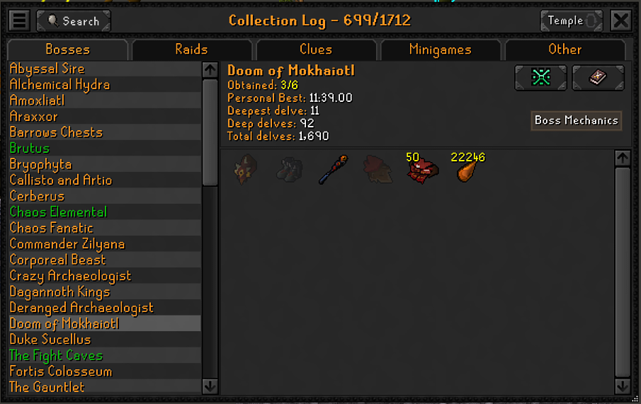
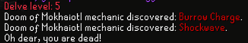
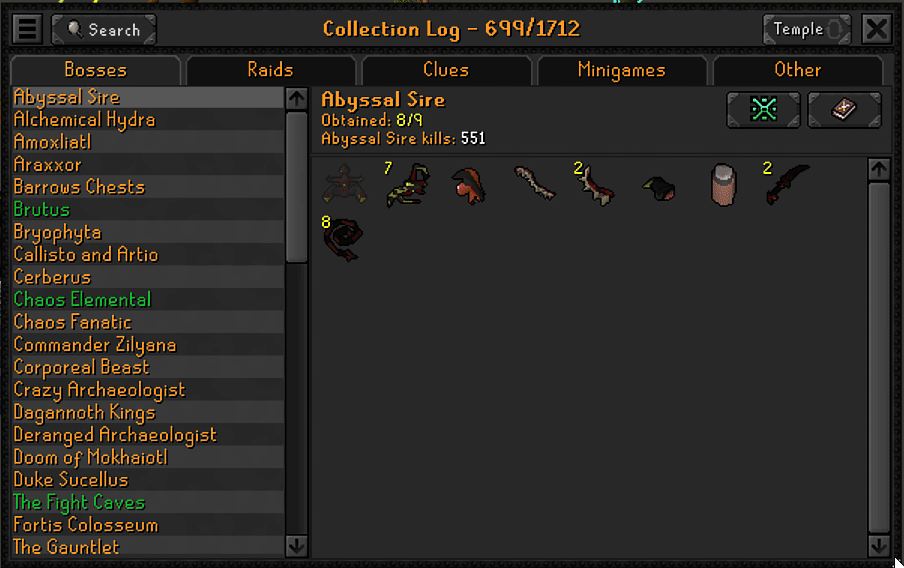

# Boss Mechanics

A boss mechanics codex that lives inside the game. Every supported
boss's collection log page gets a **Boss Mechanics** button. It opens a mechanic list
and shows you: what the boss does, what you do about
it, and a preview.

Mechanics start locked. They unlock as your client watches the boss use them. (Or just hit 'View All' to see everything).



## What it does

### Discovery

Mechanics are hidden with `???` until encountered in a fight.
When it is, the mechanic is broadcast in the game chat and 'unlocked' in the Boss Mechanics UI. 
Progress shows in a **Mechanics Discovered** bar across the top of the window.

Detection watches animations, projectiles, graphics and NPC spawns.

If you're not interested in the discovery loop **View All** reveals everything.



### Mechanic list and counter play

The left column lists the boss's mechanics in the order you (usually) meet them along with phase labels where appropriate. 
The right column holds the selected mechanic's description and its counter play. 
There is a **WIKI** button in the title bar that opens the boss's strategy page.

Selecting a mechanic plays the boss model performing that move.  Certain UI elements can't be displayed
as they are rendered by the engine during gameplay (ex., Doom's prayers or charge bar).  Will work on bridging those
gaps over time since they are critical parts of certain mechanics.



### The window

The window uses the game's steel interface sprites and sits over the
collection log.  When opened but it is draggable by its title bar anywhere on screen.

## Supported bosses

Every combat boss in the collection log's **Bosses** tab, 54 of 57. Tempoross,
Wintertodt and Zalcano are deliberately out of scope: they are skilling
encounters with no attack rotation to learn.

Most of these ship as **skeletons**: their ids come from Jagex's own gameval names
rather than guesses, but they have not been confirmed in a live fight yet. Each boss
file records exactly what is settled and what is not, and the open curation issues
track the live pass.

| Boss | Mechanics |
|---|---|
| Abyssal Sire | 9 |
| Alchemical Hydra | 5 |
| Amoxliatl | 3 |
| Araxxor | 5 |
| Barrows Chests | 7 |
| Brutus | 3 |
| Bryophyta | 2 |
| Callisto and Artio | 2 |
| Cerberus | 3 |
| Chaos Elemental | 4 |
| Chaos Fanatic | 1 |
| Commander Zilyana | 4 |
| Corporeal Beast | 4 |
| Crazy Archaeologist | 2 |
| Dagannoth Kings | 3 |
| Deranged Archaeologist | 2 |
| Doom of Mokhaiotl | 11 |
| Duke Sucellus | 6 |
| Fortis Colosseum | 8 |
| General Graardor | 5 |
| Giant Mole | 2 |
| Grotesque Guardians | 6 |
| Hespori | 3 |
| K'ril Tsutsaroth | 4 |
| Kalphite Queen | 2 |
| King Black Dragon | 3 |
| Kraken | 3 |
| Kree'arra | 4 |
| Maggot King | 3 |
| Moons of Peril | 3 |
| Nex | 6 |
| Obor | 1 |
| Phantom Muspah | 6 |
| Royal Titans | 4 |
| Sarachnis | 2 |
| Scorpia | 2 |
| Scurrius | 4 |
| Shellbane Gryphon | 4 |
| Skotizo | 4 |
| The Fight Caves | 3 |
| The Gauntlet | 4 |
| The Hueycoatl | 6 |
| The Inferno | 5 |
| The Leviathan | 5 |
| The Mad Angel | 5 |
| The Nightmare | 7 |
| The Whisperer | 5 |
| Thermonuclear Smoke Devil | 1 |
| Vardorvis | 5 |
| Venenatis and Spindel | 3 |
| Vet'ion and Calvar'ion | 4 |
| Vorkath | 6 |
| Yama | 7 |
| Zulrah | 5 |

## Settings

| Setting | Default | What it does |
|---|---|---|
| Discovery chat messages | On | Announce each newly discovered mechanic in the chatbox |
| Clear discoveries | Off | Debug tool. Forget every discovered mechanic on this character. Unticks itself once done |
| Log boss trigger ids | Off | Debug tool. Logs every animation, projectile and graphic id a tracked boss produces and which mechanic claims it, plus any collection log page title no boss data matches |
| Measure handler cost | Off | Debug tool. Tracks call count, wall time (p50/p99/max) and bytes allocated for every live-gameplay event handler. Off costs nothing: a single boolean check, no timing, no allocation |
| Dump perf stats | Off | Debug tool. Logs the perf table collected since instrumentation was last enabled (or last dumped), then resets its counters. Unticks itself once done |

## Install

Not on the RuneLite Plugin Hub yet. To run it, build from source:

```bash
gradlew runClient
```

That launches a RuneLite client with the plugin sideloaded. Requires JDK 11+.

`BossMechanicsPluginTest` is a `main()` launcher, not a JUnit test, so
`gradlew test` will not run it. Launching it from IntelliJ instead needs `-ea` in
the VM options, since RuneLite refuses to start without assertions enabled.

### Measuring performance

A plugin can only cause a stutter two ways, both on the client thread: holding it too
long during one frame, or allocating enough to trigger a GC pause. **Measure handler
cost** tracks exactly those two things, per event handler, so "does this lag my game"
has a real answer instead of a guess.

To reproduce a measurement:

1. Tick **Measure handler cost** on.
2. Play the scenario you want measured (normal play, a crowded area, a boss fight — see
   issue #81 for the full scenario list).
3. Tick **Dump perf stats**. It logs the table and unticks itself.
4. Read the table from the client log (`Boss Mechanics perf dump:`). Each row is a handler:
   call count, p50/p99/max wall time in microseconds, total bytes allocated, and bytes per call.

**The bar.** At 50fps the frame budget is 20,000us. A worst-case call under ~200us
(1% of a frame) is invisible; over ~16ms is a dropped frame and a non-starter.

**Reading the numbers.** Percentiles are bucket-resolution (the dump header says so),
accurate to within 12.5% worst case — enough to tell "fine" from "a problem," not enough
to compare two very close numbers. Bytes-per-call includes more than just the handler's
own work: `DetectionEngine`'s `anyBossPresent()` gate predicate (the open question issue
#81 exists to answer), the `Integer` autobox inside its `triggerIndex.get(triggerId)`
lookups, and the `config.logUnmatchedTriggers()` proxy read in the curation logger all
show up in the total. Expect a nonzero baseline even on a handler that looks
allocation-free by reading the code.

## Adding a boss

Please file an issue for anything you'd like changed or submit a PR for adding new bosses/adjusting copy.

## Data and attribution

Mechanic names, descriptions and counter play are hand-written, researched from the
[Old School RuneScape Wiki](https://oldschool.runescape.wiki/) (CC BY-SA 3.0).
Every boss file links its source page.

Boss Mechanics is an unofficial plugin.

## License

BSD-2-Clause. See [LICENSE](LICENSE).
